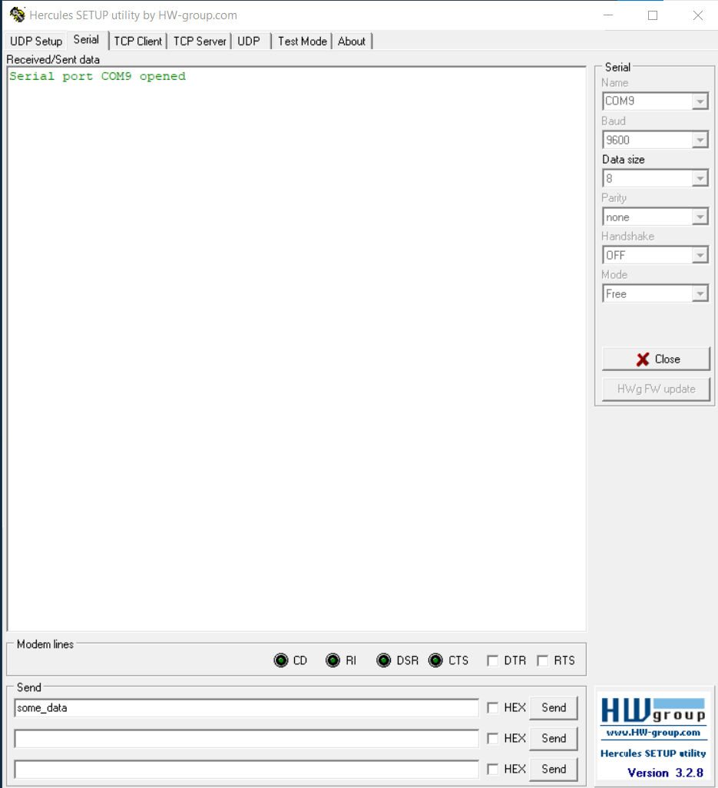

# 🚀 `UART virtual com ports communication `

#### <i> 💡 Overview </i>  

This project is a pure C implementation for UART communication. The program receives data via UART, calculates various metrics (average data transfer speed, size of received data, and CRC16 checksum), and sends this information back over UART. 

###  Features   

- ✅<b>Data Reception and Transmission:</b>Receives data through a virtual COM port and sends back calculated metrics.
- ✅<b>Average Data Transfer Speed:</b> Calculates and returns the average speed of the data transfer.
- ✅<b>Data Size Reporting:</b> Provides the size of the received data.
- ✅<b>CRC16 Error Checking:</b> Implements CRC16 checksum to ensure data integrity.  

##  🔠Tested Environment 
  
 First of all if you're using Windows you need to install [Null-Modem Emulator](https://sourceforge.net/projects/com0com/) to see <i> active virtual pair ports on your computer </i>   

##  🛠️ Connection to first virtual port 
  

Here I am using [Hercules SETUP utility](https://www.hw-group.com/software/hercules-setup-utility), which is useful serial port terminal (<i> which we need rigth now </i>), UDP/IP terminal and TCP/IP Client Server terminal.  
<i> <b>  Additional </b>You can also use Tera Term or Putty to connect to virtual com port </i>     

##  🆠Connection to main (second) virtual port   
 Here we need to connect to our main virtual port, where we will receive the data. It's the environment where you're running your program.   
 So let's run it 🙠   
  

